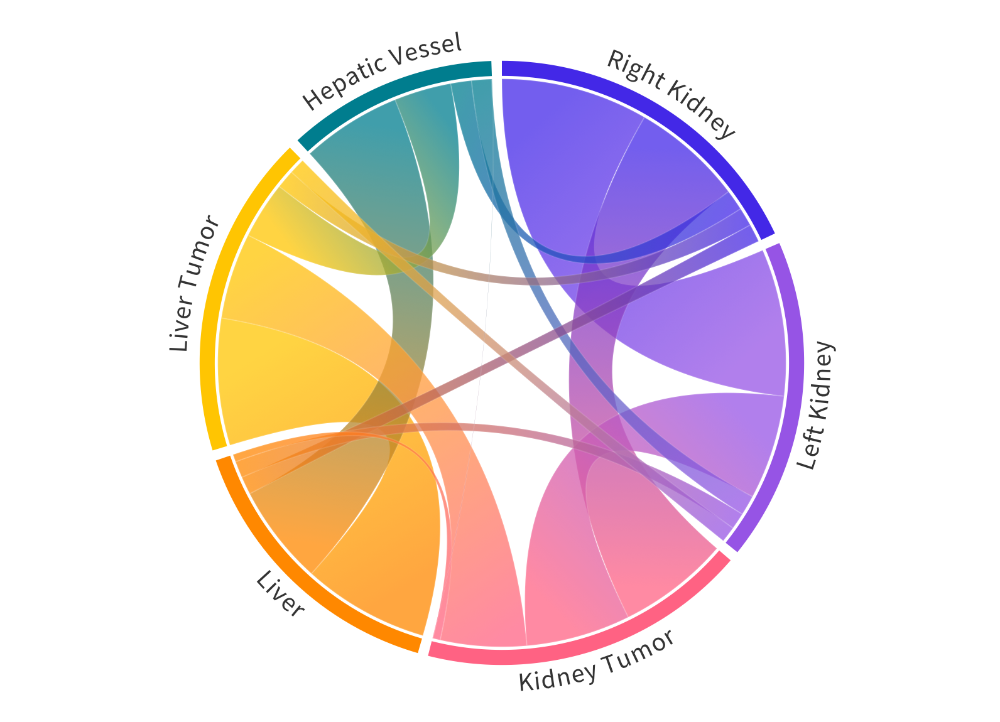

# News
 - 🔥 The pseudo-label with manual refinement could be found in [AbdonmenAtlas 1.0](https://github.com/MrGiovanni/AbdomenAtlas)
 - 🔥 We collect recent medical universal models in [AWESOME MEDICAL UNIVERSAL MODEL](documents/awesome.md) [](https://awesome.re).
 - 😎 We have document for [common questions for code](documents/common_code_questions.md) and [common questions for paper](documents/common_paper_questions.md).

# CLIP-Driven Universal Model



## Paper
This repository provides the official implementation of Universal Model.

<b>CLIP-Driven Universal Model for Organ Segmentation and Tumor Detection</b> <br/>
${\color{red} {\textbf{Rank First in Medical Segmentation Decathlon (MSD) Competition}}}$ (see [leaderboard](https://decathlon-10.grand-challenge.org/evaluation/challenge/leaderboard/)) <br/>
[Jie Liu](https://ljwztc.github.io)<sup>1</sup>, [Yixiao Zhang](https://scholar.google.com/citations?hl=en&user=lU3wroMAAAAJ)<sup>2</sup>, [Jie-Neng Chen](https://scholar.google.com/citations?hl=en&user=yLYj88sAAAAJ)<sup>2</sup>,  [Junfei Xiao](https://lambert-x.github.io)<sup>2</sup>, [Yongyi Lu](https://scholar.google.com/citations?hl=en&user=rIJ99V4AAAAJ)<sup>2</sup>, <br/>
[Yixuan Yuan](https://scholar.google.com.au/citations?user=Aho5Jv8AAAAJ&hl=en)<sup>1</sup>, [Alan Yuille](https://scholar.google.com/citations?user=FJ-huxgAAAAJ&hl=en)<sup>2</sup>, [Yucheng Tang](https://tangy5.github.io)<sup>3</sup>, [Zongwei Zhou](https://www.zongweiz.com)<sup>2</sup> <br/>
<sup>1 </sup>City University of Hong Kong,   <sup>2 </sup>Johns Hopkins University,   <sup>3 </sup>NVIDIA <br/>
ICCV, 2023 <br/>
[paper](https://arxiv.org/pdf/2301.00785.pdf) | [code](https://github.com/ljwztc/CLIP-Driven-Universal-Model) | [slides](https://github.com/ljwztc/CLIP-Driven-Universal-Model/blob/main/documents/slides.pdf) | [poster](https://github.com/ljwztc/CLIP-Driven-Universal-Model/blob/main/documents/poster.pdf) | [talk](https://www.youtube.com/watch?v=bJpI9tCTsuA) | blog

<b>Large Language-Image Model for Multi-Organ Segmentation and Cancer Detection from Computed Tomography</b> <br/>
[Jie Liu](https://ljwztc.github.io)<sup>1</sup>, [Yixiao Zhang](https://scholar.google.com/citations?hl=en&user=lU3wroMAAAAJ)<sup>2</sup>, [Jie-Neng Chen](https://scholar.google.com/citations?hl=en&user=yLYj88sAAAAJ)<sup>2</sup>,  [Junfei Xiao](https://lambert-x.github.io)<sup>2</sup>, [Yongyi Lu](https://scholar.google.com/citations?hl=en&user=rIJ99V4AAAAJ)<sup>2</sup>, <br/>
[Yixuan Yuan](https://scholar.google.com.au/citations?user=Aho5Jv8AAAAJ&hl=en)<sup>1</sup>, [Alan Yuille](https://scholar.google.com/citations?user=FJ-huxgAAAAJ&hl=en)<sup>2</sup>, [Yucheng Tang](https://tangy5.github.io)<sup>3</sup>, [Zongwei Zhou](https://www.zongweiz.com)<sup>2</sup> <br/>
<sup>1 </sup>City University of Hong Kong,   <sup>2 </sup>Johns Hopkins University,   <sup>3 </sup>NVIDIA <br/>
RSNA, 2023 <br/>
[abstract](https://github.com/ljwztc/CLIP-Driven-Universal-Model/blob/main/documents/rnsa_abstract.pdf) | [code](https://github.com/ljwztc/CLIP-Driven-Universal-Model) | slides

## Model

| Architecture | Param | Download |
|  ----  | ----  |  ----  |
| U-Net  | 19.08M | [link](https://huggingface.co/ljwztc/CLIP-Driven-Universal-Model/resolve/main/clip_driven_universal_unet.pth?download=true) |
| Swin UNETR | 62.19M | [link](https://huggingface.co/ljwztc/CLIP-Driven-Universal-Model/resolve/main/clip_driven_universal_swin_unetr.pth?download=true) |

## Dataset
- 01 [Multi-Atlas Labeling Beyond the Cranial Vault - Workshop and Challenge (BTCV)](https://www.synapse.org/#!Synapse:syn3193805/wiki/217789)
- 02 [Pancreas-CT TCIA](https://wiki.cancerimagingarchive.net/display/Public/Pancreas-CT)  ## The label we used for Dataset 01 and 02 is in [here](https://zenodo.org/records/1169361).
- 03 [Combined Healthy Abdominal Organ Segmentation (CHAOS)](https://chaos.grand-challenge.org/Combined_Healthy_Abdominal_Organ_Segmentation/)
- 04 [Liver Tumor Segmentation Challenge (LiTS)](https://competitions.codalab.org/competitions/17094#learn_the_details)
- 05 [Kidney and Kidney Tumor Segmentation (KiTS)](https://kits21.kits-challenge.org/participate#download-block)
- 06 [Liver segmentation (3D-IRCADb)](https://www.ircad.fr/research/data-sets/liver-segmentation-3d-ircadb-01/)
- 07 [WORD: A large scale dataset, benchmark and clinical applicable study for abdominal organ segmentation from CT image](https://github.com/HiLab-git/WORD)
- 08 [AbdomenCT-1K](https://github.com/JunMa11/AbdomenCT-1K)
- 09 [Multi-Modality Abdominal Multi-Organ Segmentation Challenge (AMOS)](https://amos22.grand-challenge.org)
- 10 [Decathlon (Liver, Lung, Pancreas, HepaticVessel, Spleen, Colon](https://drive.google.com/drive/folders/1HqEgzS8BV2c7xYNrZdEAnrHk7osJJ--2)
- 11 [CT volumes with multiple organ segmentations (CT-ORG)](https://wiki.cancerimagingarchive.net/pages/viewpage.action?pageId=61080890)
- 12 [AbdomenCT 12organ](https://zenodo.org/records/7860267)

The post_label can be downloaded via [link](https://portland-my.sharepoint.com/:u:/g/personal/jliu288-c_my_cityu_edu_hk/EX04Ilv4zh1Lm_HB0wnpaykB4Slef043RVWhX3lN05gylw?e=qG0DOS).

## Direct Inference in Your OWN CT scans
1. Put your all CT scans with nii.gz prefix in one directory. For example, `/home/data/ct/`.  
2. Run following code.  

```
conda create -n universalmodel python=3.7
conda activate universalmodel
pip install torch==1.11.0+cu113 torchvision==0.12.0+cu113 torchaudio==0.11.0 --extra-index-url https://download.pytorch.org/whl/cu113 
## please modify according to the CUDA version in your server
pip install 'monai[all]'
pip install -r requirements.txt
cd pretrained_weights/
wget https://huggingface.co/ljwztc/CLIP-Driven-Universal-Model/resolve/main/clip_driven_universal_swin_unetr.pth?download=true
cd ../
python pred_pseudo.py --data_root_path PATH_TO_IMG_DIR --result_save_path PATH_TO_result_DIR --resume ./pretrained_weights/clip_driven_universal_swin_unetr.pth
## For example: python pred_pseudo.py --data_root_path /home/data/ct/ --result_save_path /home/data/result --resume ./pretrained_weights/clip_driven_universal_swin_unetr.pth
```

## 0. Preliminary
```bash
python3 -m venv universal
source /data/zzhou82/environments/universal/bin/activate

git clone https://github.com/ljwztc/CLIP-Driven-Universal-Model.git
pip install torch==1.11.0+cu113 torchvision==0.12.0+cu113 torchaudio==0.11.0 --extra-index-url https://download.pytorch.org/whl/cu113
pip install 'monai[all]'
pip install -r requirements.txt
cd pretrained_weights/
wget https://github.com/Project-MONAI/MONAI-extra-test-data/releases/download/0.8.1/swin_unetr.base_5000ep_f48_lr2e-4_pretrained.pt
wget https://www.dropbox.com/s/lh5kuyjxwjsxjpl/Genesis_Chest_CT.pt
cd ../
```

**Dataset Pre-Process**  
1. Download the dataset according to the dataset link and arrange the dataset according to the `dataset/dataset_list/PAOT.txt`.  
2. Modify [ORGAN_DATASET_DIR](https://github.com/ljwztc/CLIP-Driven-Universal-Model/blob/main/label_transfer.py#L51C1-L51C18) and [NUM_WORKER](https://github.com/ljwztc/CLIP-Driven-Universal-Model/blob/main/label_transfer.py#L53) in label_transfer.py  
3. `python -W ignore label_transfer.py`


**Current Template**
|  Index   | Organ  | Index | Organ |
|  ----  | ----  |  ----  | ----  |
| 1  | Spleen | 17 | Left Lung |
| 2  | Right Kidney | 18  | Colon |
| 3  | Left Kidney | 19  | Intestine |
| 4  | Gall Bladder | 20  | Rectum |
| 5  | Esophagus | 21  | Bladder |
| 6  | Liver | 22  | Prostate |
| 7  | Stomach | 23  | Left Head of Femur |
| 8  | Aorta | 24  | Right Head of Femur |
| 9  | Postcava | 25  | Celiac Trunk |
| 10  | Portal Vein and Splenic Vein | 26  | Kidney Tumor |
| 11  | Pancreas | 27  | Liver Tumor |
| 12  | Right Adrenal Gland | 28  | Pancreas Tumor |
| 13  | Left Adrenal Gland | 29  | Hepatic Vessel Tumor |
| 14  | Duodenum | 30  | Lung Tumor |
| 15  | Hepatic Vessel | 31  | Colon Tumor |
| 16  | Right Lung | 32  | Kidney Cyst |

**How expand to new dataset with new organ?**
1. Set the following index for new organ. (e.g. 33 for vermiform appendix)  
2. Check if there are any organs that are not divided into left and right in the dataset. (e.g. kidney, lung, etc.) The `RL_Splitd` in `label_transfer.py` is used to processed this case.  
3. Set up a new transfer list for new dataset in TEMPLATE (line 58 in label_transfer.py). (If a new dataset with Intestine labeled as 1 and vermiform appendix labeled as 2, we set the transfer list as [19, 33])  
4. Run the program `label_transfer.py` to get new post-processing labels.  

**More details please take a look at [common questions](documents/common_questions.md)**

## 1. Training

```bash
CUDA_VISIBLE_DEVICES=0,1,2,3,4,5,6,7 python -W ignore -m torch.distributed.launch --nproc_per_node=8 --master_port=1234 train.py --dist True --data_root_path DATA_DIR --num_workers 12 --num_samples 4 --cache_dataset --cache_rate 0.6 --uniform_sample
```

## 2. Validation

```bash
CUDA_VISIBLE_DEVICES=0 python -W ignore validation.py --data_root_path DATA_DIR --start_epoch 10 --end_epoch 40 --epoch_interval 10 --cache_dataset --cache_rate 0.6
```

## 3. Evaluation
```
CUDA_VISIBLE_DEVICES=0 python -W ignore test.py --resume ./out/epoch_61.pth --data_root_path DATA_DIR --store_result --cache_dataset --cache_rate 0.6
```

## Todo
- [x] Code release
- [x] Dataset link
- [x] Support different backbones (SwinUNETR, Unet, DiNTS, Unet++)
- [x] Model release
- [x] Pesudo label release
- [x] Tutorials for Inference

## Acknowledgement

This work was supported by the Lustgarten Foundation for Pancreatic Cancer Research and partially by the Patrick J. McGovern Foundation Award. We appreciate the effort of the [MONAI Team](https://github.com/Project-MONAI/MONAI) to provide open-source code for the community.

## Citation

If you find this repository useful, please consider citing this paper:
```
@inproceedings{liu2023clip,
  title={Clip-driven universal model for organ segmentation and tumor detection},
  author={Liu, Jie and Zhang, Yixiao and Chen, Jie-Neng and Xiao, Junfei and Lu, Yongyi and A Landman, Bennett and Yuan, Yixuan and Yuille, Alan and Tang, Yucheng and Zhou, Zongwei},
  booktitle={Proceedings of the IEEE/CVF International Conference on Computer Vision},
  pages={21152--21164},
  year={2023}
}
```
